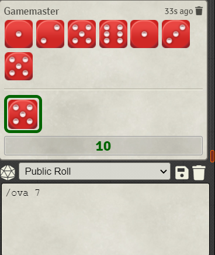
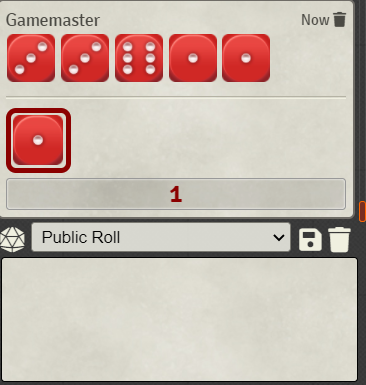

# Special Dice Roller

Supports rolling dice in your chat window for various non-regular dice systems:

* Legend of the 5 Rings 5th edition
* Vampire the Masquerade 5th edition
* Genesys
* FFG's Star Wars TTRPG
* HeroQuest
* HeXXen 1733
* FFG's Warhammer 3rd
* The One Ring
* Descent 2nd Edition
* [OVA: The Anime Role-Playing Game](https://www.wiseturtle.com)

L5R, Genesys and Star Wars images are taken from [SkyJedi's Discord Roller](https://github.com/SkyJedi/FFGNDS-Discord-Dice-Roller)

Descent 2nd Edition images are token from [j0ran](https://www.boardgamegeek.com/filepage/56448/descent-dice)

Vampire the Masquerade images are taken from [Lumi#5953's Thirst Discord bot](https://www.google.com/url?sa=t&rct=j&q=&esrc=s&source=web&cd=1&cad=rja&uact=8&ved=2ahUKEwj-iKLCjNvmAhWOyqYKHaYEC7AQFjAAegQIAhAB&url=https%3A%2F%2Fdiscordapp.com%2Foauth2%2Fauthorize%3Fclient_id%3D475234745848954905%26scope%3Dbot%26permissions%3D0&usg=AOvVaw0fV9gFSh3hD3WQd2BwJKv7).

HeXXen 1733 images a taken from the physical dice with permission from Ulisses Spiele.

Warhammer 3rd images created by [Alex Valiushko](https://github.com/illotum)

OVA images are used with permission from [Clay Gardner](https://blog.claygardner.com/)

# Installation

Go to your setup page and click on the **Add-on Modules** Tab.

Hit the button **Install Module** at the bottom.

Insert the module URL https://github.com/BernhardPosselt/foundryvtt-special-dice-roller/raw/master/module.json and click **Install**.

After you've launched your game, go to the Game Settings page and click on **Manage Modules**. Enable the Special Dice Roller app and hit **Save Module Settings**.


# Usage

You can roll a system by starting your message with the following string:

* Legend of the 5 Rings: /l5r
* FFG Star Wars: /sw
* FFG Genesys: /gen
* Vampire the Masquerade: /v5
* HeroQuest: /hq
* HeXXen 1733: /hex
* Warhammer 3rd: /wfrp3
* The One Ring: /tor
* Descent: /desc2
* OVA: /ova

Then supply a dice formula separated with a space. The formula consists of dice letters that are optionally prefixed with a number.

The roll can also contain an optional flavour text by adding a #. Everything behind the first # will be treated as flavour text.

A full roll example would be **/l5r rrs** or **/l5r 2rs**.

An example with flavour text would be **/l5r rss # comment**.

## Usage L5R

Roll Legend of the 5 Rings 5th edition dice in the chat window. Auto rolls exploding successes and let's you keep/re-roll selected dice.

Use the **/l5r** command using the following dice letters:

* r, b: ring
* s, w: skill


You can choose to either keep or re-roll certain dice. To do that, click on the dice to select them and hit either button. Re-rolled dice are removed from the roll and new rolls are attached at the end.

## Usage Genesys/Star Wars

Usage is similar to L5R but re-rolls and keeping dice is unsupported. Use the **/gen** or **/sw** commands using the following dice letters:

* b: boost
* s: setback
* a: ability
* d: difficulty
* p: proficiency
* c: challenge
* f: force (sw only)


## Usage HeroQuest

Use **/hq** to roll dice using the following dice letters:

* h: hero
* m: monster


## Usage Vampire the Masquerade

Usage is similar to L5R but keeping dice is unsupported. Use the **/v5** command using the following dice letters:

* b, s: skill dice
* h, r: hunger dice

You can choose to re-roll certain dice. To do that, click on the dice to select them and hit the re-roll button. Re-rolled dice are highlighted with a green border.


## Usage HexXen 1733

Use **/hex** to roll dice using the following dice letters:

* h: HeXXen dice
* +: Janus dice as bonus
* -: Janus dice as malus
* s: Segnung dice
* e: Elixir dice
* b: Blut dice
* f: Fluch dice

Bonus and malus are automatically calculated according to the rules.


## Usage Warhammer Fantasy Role Play 3rd

Use **/wfrp3** to roll dice using the following dice letters:

* a: characteristics
* c: conservative
* r: reckless
* e: expertise
* f: fortune
* m: misfortune
* x: challenge


## Usage The One Ring

Use **/tor** to roll dice using the following dice letters:

* d: success
* s: shadow
* t, w: weary
* f: just feat


## Usage Descent 2nd Edition

Use **/desc2** to roll dice using the following dice letters:

* r: red
* g: green
* b: blue
* y: yellow
* l: low defense (brown)
* m: mid defense (grey)
* h: high defense (black)


# Usage OVA

Use **/ova x** to roll *x* amount of dice. Use *0* or a negative number to roll negative dice (result will be in red). You can click the result to expand to view the related die face. 






# Building the Project

Install **yarn** and run:

    yarn install
    yarn build

Tests use Jest and are run via:

    yarn test
    
TSLint is used to lint files on build. You can run it separately via

    yarn run lint

and fix simple errors automatically via:

    yarn run fix

The relevant files and folders that need to be included in your (local) FoundryVTT module folder are:

* module.json
* dist/
* public/

Further development documentation is included in the docs/ folder.

# Rolling Dice Programmatically

You can access the dice roller API via the game object:

```js
game.specialDiceRoller.l5r
game.specialDiceRoller.v5
game.specialDiceRoller.genesys
game.specialDiceRoller.starWars
game.specialDiceRoller.heroQuest
game.specialDiceRoller.heXXen
game.specialDiceRoller.warhammer3
game.specialDiceRoller.tor
game.specialDiceRoller.desc2
game.specialDiceRoller.ova
```

Each roller object has a rollFormula method:

```ts
class Roller {
    /**
     * @param fomula essentially the command without the roller prefix (e.g. wwbb instead of /l5r wwbb)
     * @param flavorText? flavor text to display above the roll
     * @return the HTML for the chat window
     */
    rollFormula(formula: string, flavorText?: string): string {
        // etc
    }
}
```

This method returns the formatted HTML for a roll. You can insert that into the chat log content.
